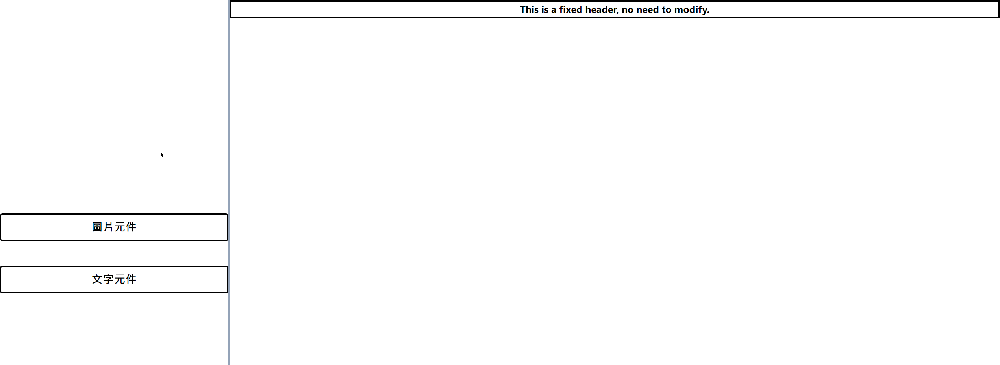
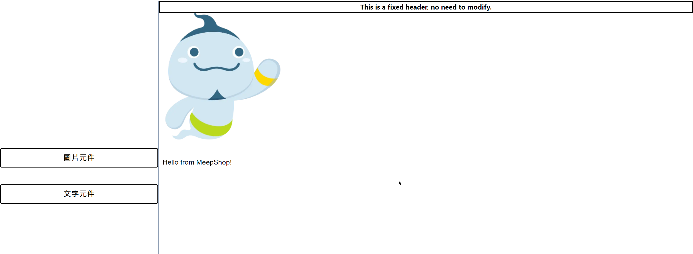
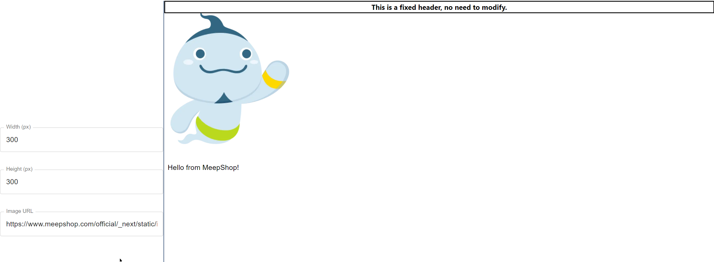
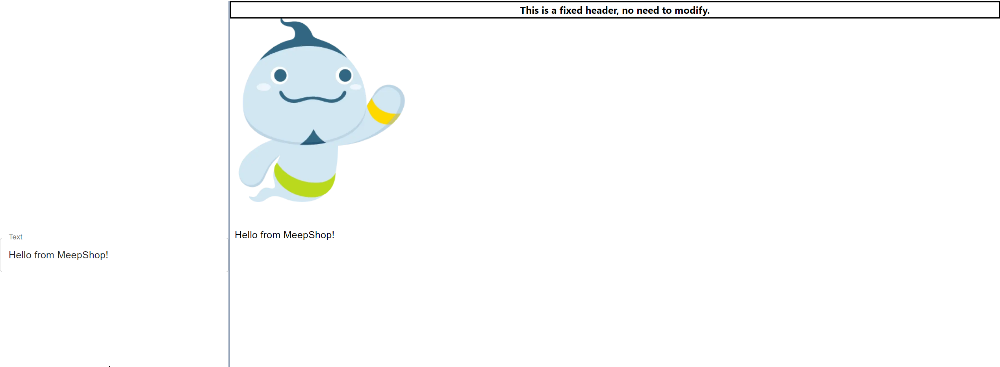
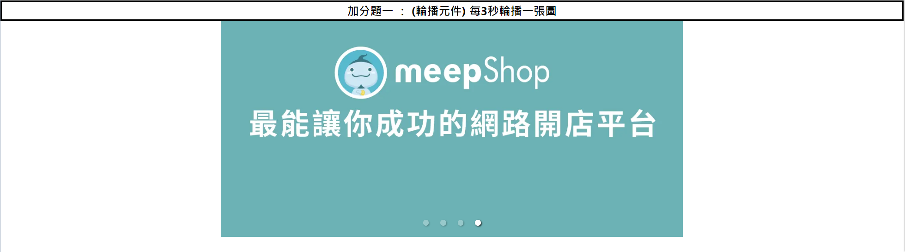
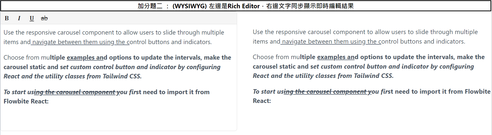

# meepShop 前端考題

## Environment Setup

### `npm install` or `yarn install`

## Run the Web

### `npm run start` or `yarn start`

## 基本題

### 初始畫面

### 拖拉滑鼠新增圖片元件與文字元件

### 圖片元件控制

### 文字元件控制

## 加分題一 ： (輪播元件) 每 3 秒輪播一張圖

## 加分題二 ： (WYSIWYG) 左邊是 Rich Editor，右邊文字同步顯示即時編輯結果

